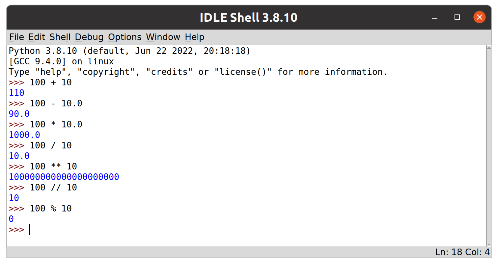
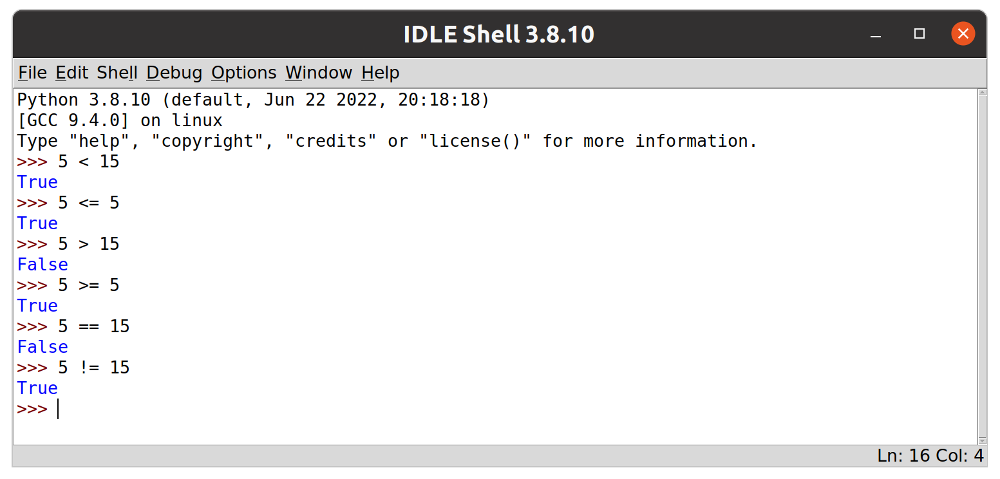
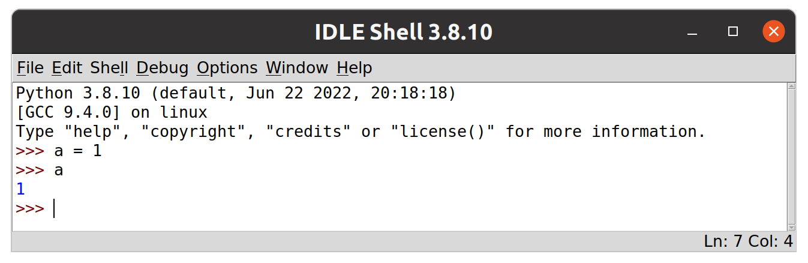
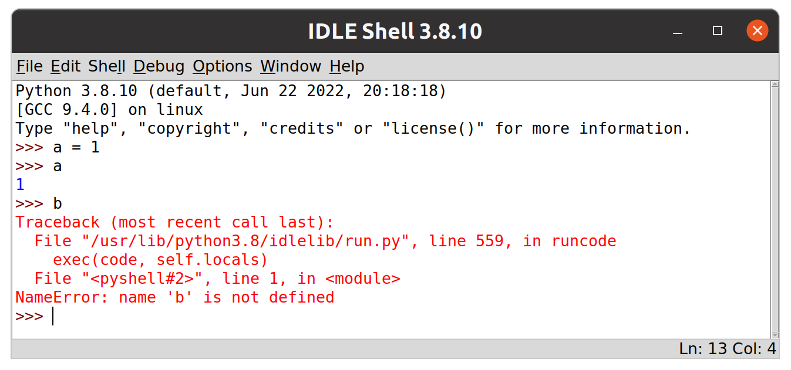

# GAMR1520: Markup languages and scripting

## Introduction to python

In this set of exercises we are assuming that you have no experience with python.
We will begin by getting familiar with some of the basics using the interactive python interpreter.
The bulk of the exercises will cover some of the fundamental aspects of python programming in isolation and by the end of this set of exercises we will move on to putting them together into short python scripts.

Following these exercises will help to develop some experience with the workflow involved in writing python code and to become familiar with how terms such as variables, types, operators, objects, methods and conditionals apply in a practical setting.

We are also hoping to reinforce a basic model of dynamically typed variables.
A core learning outcome of this set of exercises is to understand the practical implications of having type information bound to the object rather than the variable.

Though the code is pretty simple, some of the underlying features of python we expose in these exercises are somewhat complex.
When you have more experience of python, you may want to revisit this set of exercises to review the core features in simple examples.

# Table of contents

<div class="toc"></div>

- [Getting started with IDLE](#getting-started-with-idle)
- [Literals](#literals)
- [Operators](#operators)
    - [Arithmetic operators](#arithmetic-operators)
    - [Comparison operators](#comparison-operators)
    - [Logical operators](#logical-operators)
- [Variables and assignment](#variables-and-assignment)
    - [Variable names](#variable-names)
    - [NameError](#nameerror)
    - [Assigning to expressions](#assigning-to-expressions)
- [Writing larger programmes](#writing-larger-programmes)
    - [Managing source code](#managing-source-code)
- [Compound statements](#compound-statements)
    - [Conditionals](#conditionals)
    - [Adding an else clause](#adding-an-else-clause)
- [Obtaining user input](#obtaining-user-input)
- [f-strings](#f-strings)

# Getting started with IDLE

To get started, we will work with Python’s Integrated Development and Learning Environment (IDLE).

>IDLE is not a great code editor but will be useful for this introduction to the language.

Open IDLE on your machine.
It should look something like this.

<figure>
    
    <figcaption>The IDLE shell</figcaption>
</figure>

>It may not look exactly like this.
>These screenshots were created on a linux machine.
>It shouldn't matter what OS you are running.
>On Windows and MacOS IDLE is usually installed along with python.
On Linux distributions you may need to install it separately.
>
>Also, your python version may be different. 
>My system python was 3.8 when I took this screenshot (though I have now upgraded to 3.10).
>Hopefully you have a more recent version.
>As long as it's 3.6 or better you should be fine.

The main IDLE window provides an interactive python shell.
The prompt allows the user to enter any valid python statement.
Each expression entered will be evaluated and the result printed before another prompt will appear, waiting for the next statement.
This kind of interface is known as a Read, Execute, Print Loop or REPL. 

>As you work through these exercises, make sure you experiment.
>Try to enter expressions and predict what will happen. 
>be inquisitive, and see if your instincts are correct.
>
>If something unexpected happens, stop and think.
>Ask your colleagues or tutor as necessary.
>Try to come up with really hard questions and challenge our knowledge so we can learn together.

# Literals

*Literals* are constant values of built-in types.
This may sound complicated, but they are just values, expressed directly in code.
For example, an integer value included directly in your code is known as an *integer literal*.

Type a number into IDLE.

```python
123
```

Unsurprisingly, the expression evaluates to the value `123`.
This is what literals do.

Here are some more examples of literal values of different data types.

> Using a hash (`#`) at the beginning of a line creates a comment.
Comments are ignored by the interpreter.

```python
# Boolean literals
True
False

# A string literal.
'hello world'

# A float literal.
8.2

# A tuple literal with three values.
(123, 'hello world', 8.2)

# A list literal with three values.
[123, 'hello world', 8.2]

# A dictionary literal with three key-value pairs.
{'a': 1, 'b': 2, 'c': 3}
```

When interpreting these simple expressions, python is doing a surprising amount for you under the hood.
The interpreter evaluates the literal values into complex objects in memory and outputs a representation of the python objects they generate.

<figure>
    
    <figcaption>Literal values evaluate to themselves</figcaption>
</figure>

We will introduce the different data types later.
For now, the important thing to note is that we can express values directly in python code in this way.
As expected, they all evaluate to themselves.

>Notice that when literal values are evaluated they are presented back to us in a similar format to the literal syntax.

>Though single quotes are the default, we can use single or double quotes to specify string literals. 
>This allows us to include the `'` and `"` characters within strings.
>```python
>"A string containing 'single quotes'"
>'A string containing "double quotes"'
>```

<blockquote class="challenge">
    <header>Time to experiment</header>
    <p>
        Try all the examples above.
        Spend some time investigating literals in the IDLE interface.
    </p>
</blockquote>


Obviously, literals are not much use on their own.
We can combine literals, and generate new values by using operators.

# Operators

A valid expression requires two operands with an operator between them.

`<operand> <operator> <operand>`

Where an operand is a value of some kind (e.g. a literal) and an operator is something like a mathematical operator (`+`, `-` etc.).

For example:

```python
1 + 1
2 * 2
```

It is hopefully clear what these expressions mean.
They will resolve to the integer values `2` and `4` respectively.

>Getting the form wrong will lead to a syntax error.
>```python
>123 123
>123 +
>/ 123
>* 123 *
>```
>The above examples all fail because they have no sensible meaning.

## Arithmetic operators

Arithmetic operators contain few surprises.
The addition operator (`+`) adds numbers together. 
The multiplication operator (`*`) multiplies numbers together.
The following table lists the most common operators.

<figure>
<table>
    <thead>
        <tr>
        <th style="text-align:right"></th>
        <th style="text-align:left"></th>
        <th style="text-align:right"></th>
        <th style="text-align:left"></th>
        </tr>
    </thead>
    <tbody>
        <tr>
            <td><code>+</code></td>
            <td>addition</td>
            <td><code>-</code></td>
            <td>subtraction</td>
        </tr>
        <tr>
            <td><code>*</code></td>
            <td>multiplication</td>
            <td><code>/</code></td>
            <td>division</td>
        </tr>
        <tr>
            <td><code>%</code></td>
            <td>modulus (remainder)</td>
            <td><code>//</code></td>
            <td>floor division</td>
        </tr>
        <tr>
            <td><code>**</code></td>
            <td>exponentiation</td>
            <td colspan="2"></td>
        </tr>
    </tbody>
</table>
<figcaption>arithmetic operators</figcaption>
</figure>

All of these can be used with integers and floats.
If both of the operands are integers, then the output is usually an integer (except for division, which outputs a float), otherwise its usually a float.

<figure>
    
    <figcaption>examples of arithmetic operations</figcaption>
</figure>

Hopefully the results are not surprising.
Arithmetic naturally applies to integers and floating point values.

Note that Boolean values will be treated as integers in arithmetic operations.

```python
True + True     # 2
True * False    # 0
True * 3.5      # 3.5
False * 3.5     # 0.0
```

>We will also see later that some of these operators can be used with sequence data types such as strings and lists like this.
>```python
>'hello' + ' ' + 'world'
>[1, 2, 3] + [4, 5, 6]
>```
>What's a list?
>We're getting there!

## Comparison operators

Comparison operators allow two values to be compared (obviously!).
They are tests for truth and so always produce boolean outputs.

For example we can test whether one value is greater than another value.

```python
10 > 10     # False
```

In the above case, the result is `False`, since `10` is not greater than `10`.

||||||comparison operators|
|--:|:--|--:|:--|--:|:--|
|`<`|less than|`<=`|less than or equal to|`>`|greater than|
|`>=`|greater than or equal to|`==`|equal to|`!=`|not equal to| 

Their application to integers and floats are obvious.

<figure>
    
    <figcaption>examples of logical operations</figcaption>
</figure>

When used with strings, the comparison is alphanumeric.

```python
'b' > 'a'   # True
'A' > 'a'   # False
```

>Lowercase values are considered greater than uppercase values.
>This is because the unicode codepoints for the uppercase letters are before the lowercase letters.
>We can see this by using the built-in function `ord()` which will return the unicode code point for any one-character string.
>```python
>ord('A')    # 65
>ord('B')    # 66
>ord('a')    # 97
>ord('b')    # 98
>```

For longer sequences, the first elements are compared and only if they are equal will further elements be compared. 
Substrings are considered less than longer strings. 

```python
'abc' < 'abca'  # True
'abc' < 'Abca'  # False
```

## Logical operators

We can also use standard logical operators such as `not`, `and` and `or`. 

```python
not True
True and False
True or False
```

These also work with data types other than Boolean values.
Though it is not advisable to do this unless you understand precisely how it works.

>From [the documentation on boolean operations](https://docs.python.org/3/reference/expressions.html#boolean-operations):
>
>"The operator `not` yields `True` if its argument is false, `False` otherwise."
>
>"The expression x `and` y first evaluates x; if x is false, its value is returned; otherwise, y is evaluated and the resulting value is returned."
>
>"The expression x `or` y first evaluates x; if x is true, its value is returned; otherwise, y is evaluated and the resulting value is returned."

This relies on the fact that all data types have a *truth value*.
That is, all values can be evaluated as a Boolean.
We can see this by using the built-in function `bool()` to *cast* a value to a boolean value.

```python
bool(1)         # True
bool(0)         # False
bool(-1)        # True
bool(2.1)       # True
bool(0.0)       # False
bool('hello')   # True
bool('')        # False
bool([1, 2, 3]) # True
bool([])        # False
```

Basically, everything evaluates to `True` unless it is zero or empty.

>There are similar functions* to cast values to other types:
>```python
>bool("zero")   # True
>int(1.0)       # 1
>float(5)       # 5.0
>str(1000)      # '1000'
>tuple('OK')    # ('O', 'K')
>list('WAT')    # ['W', 'A', 'T']
>dict(['OK'])   # {'O': 'K'}
>```
>[Built-in functions](https://docs.python.org/3/library/functions.html) are part of the basic python toolkit.
>We will introduce a number of other useful built-in functions in this set of exercises.
>
>*actually, these are not all strictly functions, some are type constructors.

The explicit casting to a boolean is not required when evaluating the *truthiness* of a value.
Python will actually call `bool()` for you here.

```python
not 12      # False
12 or 15    # 12
'' or 15    # 15
12 and 15   # 15
'' and 15   # ''
``` 

>This feature allows for some very *clear* code, as we shall see later when we look at conditionals and loops. 
>The Python community values clarity very highly.

Combinations of operators are fine, this can get as complicated as you like.
The usual precedence applies (brackets are evaluated first, then exponentiation, multiplication and division, addition and subtraction and finally comparisons and boolean operations). 

Higher precedence operations are evaluated before lower precedence operations.

Look at each of these expressions and try to predict how they will be evaluated.

```python
100 > 120 * 6 + 15
(100 > 120) * 6 + 15
200 / 25 != 2 ** 3
200 / (25 != 2) ** 3
100 > 120 * 6 + 15 or 200 / 25 != 2 ** 3
100 > 120 * 6 + 15 or 200 / (25 != 2) ** 3
(100 > 120) * 6 + 15 or 200 / (25 != 2) ** 3
(100 > 120) * 6 + (15 or 200) / (25 != 2) ** 3
```

Try them out in IDLE and see if you predicted correctly.

Notice that, for example, the comparison operations are evaluated last unless they are enclosed in brackets.


<blockquote class="challenge">
    <header>More experimentation</header>
    <p>
        Try different combinations of operators.
        See what errors you can cause.
        Check to see if you understand what is going on.
    </p>
    <ul>
        <li>Perform some calculations</li>
        <li>Perform some string manipulation</li>
        <li>Cause a TypeError by combining different data types</li>
    </ul>
</blockquote>


# Variables and assignment

In the above examples we used literal values such as `True`, `'hello'`, `120` and `1.0`.
When these literal values are interpreted, the data they represent are stored in memory.
In our very simple, one-line programmes we combined literals with operators and the calculations were also applied in memory before the result was displayed by the interactive interpreter.

Because we no longer have a reference to these values, neither the literal values, nor the results of the calculations are accessible to our programme.
However, the data remain in memory until the Python *garbage collector* finds them and frees up the memory for reuse.
Python automatically does this with any data our programme cannot access.

Variables allow us to access and manipulate values in memory across multiple python expressions.
We can capture meaningful values in memory and use them in our programme by assigning them to variables.

We use the `=` operator for assignment.
Try the following.

```python
a = 1
```

The code is assigning the value `1` to a name `a`.
This causes the value `1` to be stored in memory and provides our programme with access to this value via the name `a`.

> The data stored in memory includes more information than just the value `1`.
It includes information about the type of data and more.

If we want to see the value of `a` we can simply evaluate the variable, just like we did with literals. 
The expression `a` evaluates to `1`.

<figure>
    
    <figcaption>Assignment to, and subsequent evaluation of, a variable</figcaption>
</figure>

>You may notice that IDLE generates no output for the assignment operation.
>This is because assignment operations evaluate to the special value `None`.
>IDLE outputs nothing when expressions evaluate to `None`
>You can confirm this by entering the `None` literal value into IDLE.
>```python
>None
>```
>Again, IDLE generates no output.
>`None` is different from `0` or `False`, it represents no value.

## Variable names

OK, `a` can be a fine name for a variable.
However, in most cases a variable should be given a meaningful name, [reflecting its usage in the code](https://peps.python.org/pep-0008/#overriding-principle).
It is good practice to use [multi_word_names](https://peps.python.org/pep-0008/#function-and-variable-names), separated with underscores as necessary, whilst keeping the [line length](https://peps.python.org/pep-0008/#maximum-line-length) of your code within ~79 characters. 

In older versions of Python, variable names were restricted to all uppercase and lowercase letters [A-Z] and underscores.
Digits were also allowed, but not for the first character.
Keywords, such as `while`, `if`, `def` and `for` are not allowed.

Since Python 3, this scheme was extended to allow unicode characters.
So this is fine:

```python
π = 3.14159
```

If you choose an invalid variable name you will get a syntax error.

```python
# SyntaxError, can't start with a number!
2π = 3.14159 * 2            

# SyntaxError, no spaces allowed!
hello world = 3.14159 * 2   

# SyntaxError, def is a keyword!
def = 5                     
```

One thing to be careful of is to avoid using the names of built-in functions or modules, especially if you are using them in your code.
The following code replaces the built-in `bool()` function with another value and so raises an error when we try to treat the `bool` name as if it still referenced the `bool()` function.

```python
bool(1)            # True
bool = 'hello'     # Overwrites bool with a new value
bool(1)            # TypeError, 'str' object is not callable
```

The error tells us that `bool` is a 'str' object and is not callable.
This is the clue we need to review the code and identify where we assign a string to the name `bool`.

> Error messages usually hold the answer or a big clue about what went wrong.
> It's very important to study the message in detail.

In terms of style, there are guidelines.
The classic design guide [PEP8](https://peps.python.org/pep-0008/) (the eighth Python Enhancement Proposal) suggests "lowercase with words separated by underscores as necessary to improve readability" for both variable and function names.

```python
variable_name = function_name()
```

Whereas, class names are always capitalised, using upper camel case rather than underscores at word boundaries.

```python
my_instance = MyClass()
```

We also expect spaces around operators under most circumstances.
So these are bad style.

```python
variable_name= function_name()  # No!
my_instance=MyClass()           # Bad!
```

> All moderately experienced developers will notice if you break the law and will consider it as a style bug in your code!
> You should read PEP8 once you have a basic grasp of python concepts as it will help you to align your style with the community.

## NameError

If we try to evaluate a variable that has not yet been created, the result is a particular error called a `NameError`.

<figure>
    
    <figcaption>Accessing variables without defining them first results in a NameError</figcaption>
</figure>

The error message is clear, "name 'b' is not defined".
This error would crash our programme if we did not handle it.

## Assigning to expressions

We have seen that we need a valid variable name on the left hand side of the assignment operator (`=`).

The value on the right hand side of the assignment operator can be any valid python expression. 
This allows us to store calculated values.

For example:

```python
a = 1 + 1
a = a * 2
```

> This is a fundamental operation in programming, we can store values in memory and manipulate them in a stepwise fashion, line by line.

The right hand side is evaluated first and then the result is assigned to the variable on the left hand side.

For convenience, python also includes augmented assignment expressions which modify the value on the left side directly.

```python
a += 1
```

This is equivalent to calculating the value and then assigning.

```python
a = a + 1
``` 

This can be done with all the arithmetic operations.

||augmented assignment operators|
|--:|:--|
|`+=`|addition assignment|
|`-=`|subtraction assignment|
|`*=`|multiplication assignment|
|`/=`|division assignment|
|`%=`|modulo assignment|
|`//=`|floor division assignment|
|`**=`|exponentiation assignment|

<blockquote class="challenge">
    <header>Keep experimenting</header>
    <p>
        In the next section we are going to start working with larger programmes.
        However, you can write simple programmes in the IDLE interactive prompt.
    </p>
    <ul>
        <li>
            Experiment with assigning values to variables.
        </li>
        <li>
            Use expressions which combine literals and operators.
        </li>
        <li>
            Enter expressions which combine your variables further.
        </li>
        <li>
            e.g. calculate the radius and circumference of a circle with a given radius.
        </li>
        <li>
            Raise a NameError.
        </li>
    </ul>
    <p>
    </p>
</blockquote>


# Writing larger programmes

So far we have been looking at very simple, one-liner programmes.
At some point we need to move beyond this and write programmes consisting of several steps.

## Managing source code

In order to write longer programmes with multiple statements, we need to move from the interactive interpreter to working with source code files.

Using the file menu in IDLE, go to *file -> new file* (or use the shortcut *Ctrl + N*) to open a new IDLE file window.

There should now be two IDLE windows open; the interpreter (or shell) and a new, empty file window, ready to receive code.

Programmes written in this way won't automatically output the evaluated result of each line like the shell does.
To generate output in the shell we must explicitly use the built-in `print()` function.

Type this into the file window.

```python
print('Hello world')
```

Anything passed into the `print()` function will be automatically converted to a string (using `str()`) and by default will be sent to the terminal.

> It's possible to `print()` to files also, as we will see later. 

Now save your programme to a sensible location on your filesystem using the *file -> save* option ( or *Ctrl + S*).

> It is recommended that you create a folder for today's work (probably inside a folder for the module) and save your code in there.
>Try to avoid spaces or hyphens in your file names, underscores are fine.
> For example, this file could be named **hello_world.py**

In IDLE, files can be executed via the `Run` menu.
Go to `Run -> Run Module` (or use the shortcut key F5) to execute our first python programme.

> A python file is known as a module. 
A collection of modules is known as a package.

You should see the code runs in the IDLE shell and outputs our message.

<figure>
    
    <figcaption>A script running in the IDLE shell</figcaption>
</figure>

> Did you notice, I upgraded my python version!

<blockquote class="challenge">
    <header>
        Write a script
    </header>
    <p>
        Try writing some simple programmes of your own that combines everything you have learned so far.
    </p>
    <p>
        Create new files and keep your experiments for later reference.
    </p>
</blockquote>


# Compound statements

Now we can write more complex programmes, we need a way to control the flow of execution. 
In Python, the main way we can do this is via [Compound statements](https://docs.python.org/3/reference/compound_stmts.html).
Essentially, compound statements define blocks of code that should be executed under certain circumstances.

Compound statements are made up of `clauses`.
Clauses have a `header` and an indented code block.
There may be multiple clauses in a compound statement.

This is a simple compound statement with just one clause:

```python
if balanceA >= amount:
    balanceA -= amount
    balanceB += amount
```

> This example code is incomplete.
If you run this code, it will raise a NameError because the variables have not been defined.
We are just showing the structure of a compound statement.

Each clause begins with a header.
This is the `if` line in our example.
The header will begin with a keyword (`if` in this case) and will end in a colon (`:`).
The code block following the header consists of one or more indented statements and must end with a `dedent`, when the code returns to the original indentation level, this indicates the end of the code block.

**Be very careful with indentation!**
It is part of the syntax in python, this keeps the code clean and readable.
Often, if you get the indentation wrong, your code will not run. 
This is good because you can locate the problem and resolve it.
However, in some cases, a mistake in the indentation can lead to code which runs without error, but does not behave as intended.

## Conditionals

The simplest example of a compound statement is probably a `conditional`.
Conditional statements allow us to make decisions in our code based on Boolean values.
This is achieved using `if`, `else` and `elif` keywords.

The following code demonstrates a simple `if` clause.

```python
if balanceA >= amount:
    balanceA -= amount
    balanceB += amount
```

>Yes, we've seen this before as an example of a compound statement, now we are talking about `if` specifically.

Notice that the `if` line ends with a colon.
After the `if` line, there is an indented code block.
The code block could contain any number of lines, but in this case it contains only two lines.

The code is moving funds from one account to another.
The header checks whether `balanceA` is large enough to make the move.
The code block reduces `balanceA` and increases `balanceB`.

The behaviour of this code will depend on the value of the variables.
If `balanceA` is less than the required `amount`, then the block will be skipped and both balances will be unaffected.
However, if `balanceA` is greater than or equal to the required `amount` then the block will be executed and the balances will be affected accordingly.

Note that, if any of these variables was undefined, the code would raise a `NameError` and, if the variables were of a type that cannot be compared with or added to each other (e.g. a string), the code would raise a `TypeError`. These errors would crash the programme.


<blockquote class="challenge">
<header>Complete the code</header>
<p>
    Write the code into a file <strong>balance.py</strong>
    Expand the programme by declaring the variables and giving them initial values.
    Add some <code>print()</code> statements to generate output.
    Try a few values for the variables to see what you get.
    Can you produce errors by assigning the variables to data of the wrong types?
</p>
<p>
    Remember, you need to save code with <em>Ctrl + s</em> and press <em>F5</em> to execute.
</p>
</blockquote>


>Compound statements can be entered into the IDLE interactive shell, but its a bit tricky and annoying.
>
>After entering the `if` clause (don't forget the colon), press enter and the prompt should automatically indent.
>Continue typing the code block, line by line, pressing enter at the end of each line.
>Once finished, press enter again to indicate the code block is complete.
><figure>
>    
>    <figcaption>Compound statements in the IDLE shell</figcaption>
></figure>
>Its often easier to write small code snippets into files and add `print()` statements to see what's going on.


## Adding an `else` clause

Conditionals can be extended with an `else` clause to provide another code block to execute only if the condition fails.
With this kind of conditional, we can be sure that one or other of the code blocks will execute, but never both.

Here is an extended programme to which we have added a simple message to indicate that the conditional test failed.

```python
balanceA = 100
balanceB = 50
amount = 10

if balanceA >= amount:
    balanceA -= amount
    balanceB += amount
else:
    print("Insufficient funds!")

print("Balance A: ", balanceA)
print("Balance B: ", balanceB)
```

What's going on here?
Can you see which lines of code execute and when?
Remember, indentation is important.
What happens if we set `amount` to `60` or `balanceA` to `0`?

Let's review what we have learned with another example.

Create a new file with *Ctrl + n* and add the following code.

```python
a = 10
b = 20
if a > b:
    print('a is larger than b')
else:
    print('b is larger than a')
```

Save the above code as **conditionals.py** and press F5 to execute.

<figure>
    <div class="row">
        
        
    </div>
    <figcaption>The IDLE script and shell windows</figcaption>
</figure>

>Be careful not to confuse the interpreter window with the script window.
>The interpreter window has `>>>` prompts.
>The script window should show only your code.


<blockquote class="challenge">
    <header>
        Can you see a flaw in the above code?
    </header>
    <p>
        What happens when <code>a</code> and <code>b</code> are equal?
    </p>
    <p>
        It's also possible to add <code>elif</code> clauses between <code>if</code> and <code>else</code> clauses.
        Write an improved programme which handles all three cases using an <code>elif</code> clause.
        Use <a href="https://docs.python.org/3/tutorial/controlflow.html#if-statements">the python documentation</a> for help.
    </p>
</blockquote>

# Obtaining user input

We have already seen how we can use the built-in `print()` function to generate output from our scripts.
If we want to take user input, we can use the `input()` function.

The built in `input()` function is a simple way to get input from users via the terminal/shell/command prompt.
When we call `input()`, our programme will wait to allow the user to type something and press enter.
Once the user enters a value, the `input()` function returns a string containing whatever the user typed.

> You need to go to the IDLE shell window to enter some input.
> If the user does not press enter, the programme will wait forever.

The `input()` function can take an optional argument which it will output as a prompt for the user.
Create a new file **greeting.py** and try the following.

```python
name = input('Enter your name: ')
print('Hello ' + name)
```

This allows us to write little scripts that actually do things!

Now, we can experiment with our **balance.py** script to make it more interactive.
We want to display the balances, then ask the user how much they want to transfer and display the resulting balances.

> If you closed the file, use the *file -> open* menu option to reopen it.

Here's some new code:

> There is a bug which will present itself if you run the code.
> Look closely, can you find the bug before running it?
> It's not obvious. 


```python
balanceA = 10
balanceB = 0

print("Balance A: ", balanceA)
print("Balance B: ", balanceB)

amount = input("Amount to transfer from A to B:")

if balanceA >= amount:
    balanceA -= amount
    balanceB += amount
else:
    print("Insufficient funds!")

print("Balance A: ", balanceA)
print("Balance B: ", balanceB)
```

Consider what the variable `amount` will equal and how it is used in the conditional statement.
We are using a comparison operator to compare `balanceA` with `amount`.

Since the `amount` variable is assigned to the result of a call to `input()`, it will contain a string.
The user may enter the string `'5'` or `'banana'`, either way, it's still a string.

To do the comparison, we need to cast the result to a number (either using `float` or `int`, depending on what we want).

Fix the programme by adding this line.

```python
amount = float(amount)
```
It needs to be added after the `input()` line and before the comparison.

> Alternatively, the entire call to `input()` can be wrapped in a call to `float()`.
>```python
>amount = float(input("Amount to transfer from A to B:"))
>```

<blockquote class="challenge">
    <header>
        Develop your existing examples
    </header>
    <p>
        Upgrade your favourite scripts with some user input. 
    </p>
    <p>
        Wherever you have string literals, consider replacing them with user input.
        It won't always be appropriate.
    </p>
    <p>
        If you have integer or float literals, can you convert input strings to the right data type?
    </p>
</blockquote>


# f-strings

Consider this simple programme.

```python
name = input('Enter your name: ')
print(name + ' has ' + str(len(name)) + ' letters.')
```

This is a bit complicated.
Concatenating strings like this is not good practice.
For efficiency and clarity.
We can improve it by using the so-called f-string formatting system.

F-strings allow python expressions to be embedded within strings.
We create them by adding an `f` character *before* the first quotation mark and placing python expressions inside the string within curly braces.

```python
name = input('Enter your name: ')
greeting = f'Hello {name}'
print(greeting)
```

A more complicated example.

```python
name = input('Enter your name: ')
print(f'Hello {name}, your name has {len(name)} letters.')
```

This is much more intuitive to read than the concatenated example above.

> Interpolated expressions in f-strings are automatically converted to strings.


