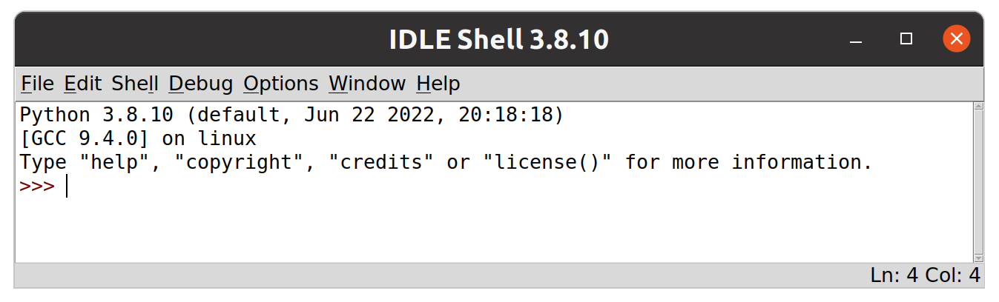
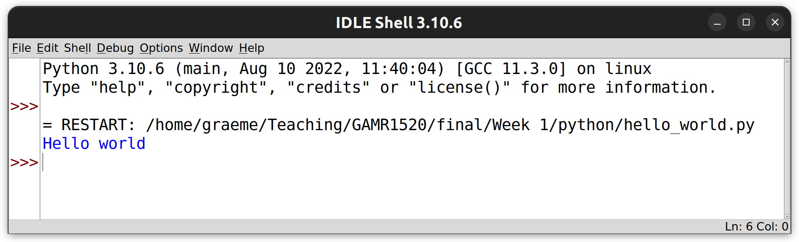
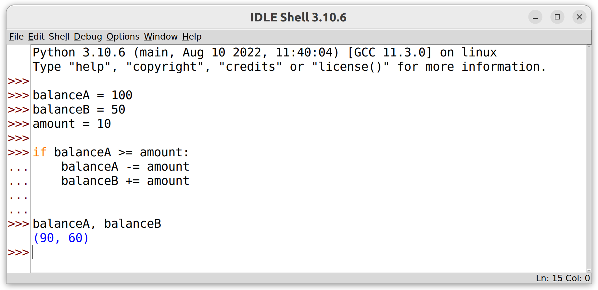
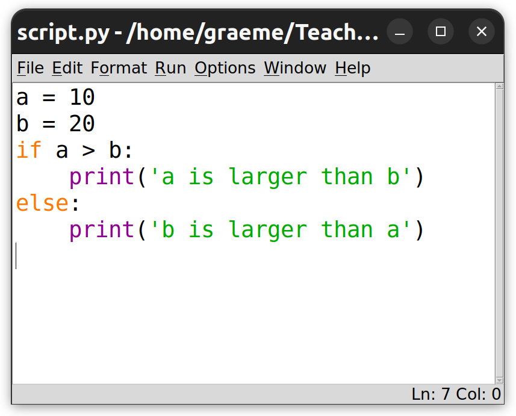
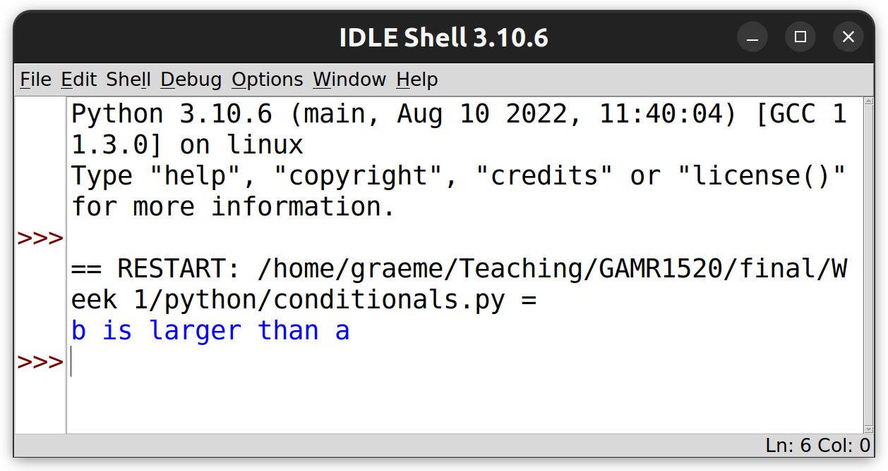

# GAMR1520: Markup languages and scripting

## Introduction to python

In this set of exercises we are assuming that you have no experience with python.
We will begin by getting familiar with some of the basics using the interactive python interpreter.
The bulk of the exercises will cover some of the fundamental aspects of python programming in isolation and by the end of this set of exercises we will move on to putting them together into short python scripts.

Following these exercises will help to develop some experience with the workflow involved in writing python code and to become familiar with how terms such as literals, variables, types and operators apply in a practical setting.

# Table of contents

<div class="toc"></div>

- [Getting started with IDLE](#getting-started-with-idle)


- [Writing larger programmes](#writing-larger-programmes)
    - [Managing source code](#managing-source-code)
- [Compound statements](#compound-statements)
    - [Conditionals](#conditionals)
    - [Adding an else clause](#adding-an-else-clause)
- [Obtaining user input](#obtaining-user-input)

# Getting started with IDLE

To get started, we will work with Python’s Integrated Development and Learning Environment (IDLE).

>IDLE is not a great code editor but will be useful for this introduction to the language.

Open IDLE on your machine.
It should look something like this.

<figure>
    
    <figcaption>The IDLE shell</figcaption>
</figure>

>It may not look exactly like this.
>These screenshots were created on a linux machine.
>It shouldn't matter what OS you are running.
>On Windows and MacOS IDLE is usually installed along with python.
On Linux distributions you may need to install it separately.
>
>Also, your python version may be different. 
>My system python was 3.8 when I took this screenshot (though I have now upgraded to 3.10).
>Hopefully you have a more recent version.
>As long as it's 3.6 or better you should be fine.

The main IDLE window provides an interactive python shell.
The prompt allows the user to enter any valid python statement.
Each expression entered will be evaluated and the result printed before another prompt will appear, waiting for the next statement.
This kind of interface is known as a Read, Execute, Print Loop or REPL. 

>As you work through these exercises, make sure you experiment.
>Try to enter expressions and predict what will happen. 
>be inquisitive, and see if your instincts are correct.
>
>If something unexpected happens, stop and think.
>Ask your colleagues or tutor as necessary.
>Try to come up with really hard questions and challenge our knowledge so we can learn together.

# Basic principles

Research [literals](python/literals) in python (and other languages).

<blockquote class="challenge">
    <header>Time to experiment</header>
    <p>
        Practice entering literal expressions into IDLE.
        Make sure you understand what is going on.
    </p>
</blockquote>

Obviously, literals are not much use on their own.
We can combine literals, and generate new values by using operators.
Read through the [operators](python/operators) page and try all the examples.

<blockquote class="challenge">
    <header>More experimentation</header>
    <p>
        Try different combinations of operators.
        See what errors you can cause.
        Check to see if you understand what is going on.
    </p>
    <ul>
        <li>Perform some calculations</li>
        <li>Perform some string manipulation</li>
        <li>Cause a TypeError by combining different data types</li>
    </ul>
</blockquote>

Manipulating data is limited without variables to store data.
Read through the [variables and assignment](python/variables) page and try all the examples.

<blockquote class="challenge">
    <header>Keep experimenting</header>
    <p>
        In the next section we are going to start working with larger programmes.
        However, you can write simple programmes in the IDLE interactive prompt.
    </p>
    <ul>
        <li>
            Experiment with assigning values to variables.
        </li>
        <li>
            Use expressions which combine literals and operators.
        </li>
        <li>
            Enter expressions which combine your variables further.
        </li>
        <li>
            e.g. calculate the radius and circumference of a circle with a given radius.
        </li>
        <li>
            Raise a NameError.
        </li>
    </ul>
    <p>
    </p>
</blockquote>


# Writing larger programmes

So far we have been looking at very simple, one-liner programmes.
At some point we need to move beyond this and write programmes consisting of several steps.

## Managing source code

In order to write longer programmes with multiple statements, we need to move from the interactive interpreter to working with source code files.

Using the file menu in IDLE, go to *file -> new file* (or use the shortcut *Ctrl + N*) to open a new IDLE file window.

There should now be two IDLE windows open; the interpreter (or shell) and a new, empty file window, ready to receive code.

Programmes written in this way won't automatically output the evaluated result of each line like the shell does.
To generate output in the shell we must explicitly use the built-in `print()` function.

Type this into the file window.

```python
print('Hello world')
```

Anything passed into the `print()` function will be automatically converted to a string (using `str()`) and by default will be sent to the terminal.

> It's possible to `print()` to files also, as we will see later. 

Now save your programme to a sensible location on your filesystem using the *file -> save* option ( or *Ctrl + S*).

> It is recommended that you create a folder for today's work (probably inside a folder for the module) and save your code in there.
>Try to avoid spaces or hyphens in your file names, underscores are fine.
> For example, this file could be named **hello_world.py**

In IDLE, files can be executed via the `Run` menu.
Go to `Run -> Run Module` (or use the shortcut key F5) to execute our first python programme.

> A python file is known as a module. 
? A folder containing a collection of modules is known as a package.

You should see the code runs in the IDLE shell and outputs our message.

<figure>
    
    <figcaption>A script running in the IDLE shell</figcaption>
</figure>

> Did you notice, I upgraded my python version!

<blockquote class="challenge">
    <header>
        Write a script
    </header>
    <p>
        Try writing some simple programmes of your own that combines everything you have learned so far.
    </p>
    <p>
        Create new files and keep your experiments for later reference.
    </p>
</blockquote>


# Compound statements

Now we can write more complex programmes, we need a way to control the flow of execution. 
In Python, the main way we can do this is via [Compound statements](https://docs.python.org/3/reference/compound_stmts.html).
Essentially, compound statements define blocks of code that should be executed under certain circumstances.

Compound statements are made up of `clauses`.
Clauses have a `header` and an indented code block.
There may be multiple clauses in a compound statement.

This is a simple compound statement with just one clause:

```python
if balanceA >= amount:
    balanceA -= amount
    balanceB += amount
```

> This example code is incomplete.
If you run this code, it will raise a NameError because the variables have not been defined.
We are just showing the structure of a compound statement.

Each clause begins with a header.
This is the `if` line in our example.
The header will begin with a keyword (`if` in this case) and will end in a colon (`:`).
The code block following the header consists of one or more indented statements and must end with a `dedent`, when the code returns to the original indentation level, this indicates the end of the code block.

**Be very careful with indentation!**
It is part of the syntax in python, this keeps the code clean and readable.
Often, if you get the indentation wrong, your code will not run. 
This is good because you can locate the problem and resolve it.
However, in some cases, a mistake in the indentation can lead to code which runs without error, but does not behave as intended.

## Conditionals

The simplest example of a compound statement is probably a `conditional`.
Conditional statements allow us to make decisions in our code based on Boolean values.
This is achieved using `if`, `else` and `elif` keywords.

The following code demonstrates a simple `if` clause.

```python
if balanceA >= amount:
    balanceA -= amount
    balanceB += amount
```

>Yes, we've seen this before as an example of a compound statement, now we are talking about `if` specifically.

Notice that the `if` line ends with a colon.
After the `if` line, there is an indented code block.
The code block could contain any number of lines, but in this case it contains only two lines.

The code is moving funds from one account to another.
The header checks whether `balanceA` is large enough to make the move.
The code block reduces `balanceA` and increases `balanceB`.

The behaviour of this code will depend on the value of the variables.
If `balanceA` is less than the required `amount`, then the block will be skipped and both balances will be unaffected.
However, if `balanceA` is greater than or equal to the required `amount` then the block will be executed and the balances will be affected accordingly.

Note that, if any of these variables was undefined, the code would raise a `NameError` and, if the variables were of a type that cannot be compared with or added to each other (e.g. a string), the code would raise a `TypeError`. These errors would crash the programme.


<blockquote class="challenge">
<header>Complete the code</header>
<p>
    Write the code into a file <strong>balance.py</strong>
    Expand the programme by declaring the variables and giving them initial values.
    Add some <code>print()</code> statements to generate output.
    Try a few values for the variables to see what you get.
    Can you produce errors by assigning the variables to data of the wrong types?
</p>
<p>
    Remember, you need to save code with <em>Ctrl + s</em> and press <em>F5</em> to execute.
</p>
</blockquote>


>Compound statements can be entered into the IDLE interactive shell, but its a bit tricky and annoying.
>
>After entering the `if` clause (don't forget the colon), press enter and the prompt should automatically indent.
>Continue typing the code block, line by line, pressing enter at the end of each line.
>Once finished, press enter again to indicate the code block is complete.
><figure>
>    
>    <figcaption>Compound statements in the IDLE shell</figcaption>
></figure>
>Its often easier to write small code snippets into files and add `print()` statements to see what's going on.


## Adding an `else` clause

Conditionals can be extended with an `else` clause to provide another code block to execute only if the condition fails.
With this kind of conditional, we can be sure that one or other of the code blocks will execute, but never both.

Here is an extended programme to which we have added a simple message to indicate that the conditional test failed.

```python
balanceA = 100
balanceB = 50
amount = 10

if balanceA >= amount:
    balanceA -= amount
    balanceB += amount
else:
    print("Insufficient funds!")

print("Balance A: ", balanceA)
print("Balance B: ", balanceB)
```

What's going on here?
Can you see which lines of code execute and when?
Remember, indentation is important.
What happens if we set `amount` to `60` or `balanceA` to `0`?

Let's review what we have learned with another example.

Create a new file with *Ctrl + n* and add the following code.

```python
a = 10
b = 20
if a > b:
    print('a is larger than b')
else:
    print('b is larger than a')
```

Save the above code as **conditionals.py** and press F5 to execute.

<figure>
    <div class="row">
        
        
    </div>
    <figcaption>The IDLE script and shell windows</figcaption>
</figure>

>Be careful not to confuse the interpreter window with the script window.
>The interpreter window has `>>>` prompts.
>The script window should show only your code.


<blockquote class="challenge">
    <header>
        Can you see a flaw in the above code?
    </header>
    <p>
        What happens when <code>a</code> and <code>b</code> are equal?
    </p>
    <p>
        It's also possible to add <code>elif</code> clauses between <code>if</code> and <code>else</code> clauses.
        Write an improved programme which handles all three cases using an <code>elif</code> clause.
        Use <a href="https://docs.python.org/3/tutorial/controlflow.html#if-statements">the python documentation</a> for help.
    </p>
</blockquote>

# Obtaining user input

We have already seen how we can use the built-in `print()` function to generate output from our scripts.
If we want to take user input, we can use the `input()` function.

The built in `input()` function is a simple way to get input from users via the terminal/shell/command prompt.
When we call `input()`, our programme will wait to allow the user to type something and press enter.
Once the user enters a value, the `input()` function returns a string containing whatever the user typed.

> You need to go to the IDLE shell window to enter some input.
> If the user does not press enter, the programme will wait forever.

The `input()` function can take an optional argument which it will output as a prompt for the user.
Create a new file **greeting.py** and try the following.

```python
name = input('Enter your name: ')
print('Hello ' + name)
```

This allows us to write little scripts that actually do things!

Now, we can experiment with our **balance.py** script to make it more interactive.
We want to display the balances, then ask the user how much they want to transfer and display the resulting balances.

> If you closed the file, use the *file -> open* menu option to reopen it.

Here's some new code:

> There is a bug which will present itself if you run the code.
> Look closely, can you find the bug before running it?
> It's not obvious. 


```python
balanceA = 10
balanceB = 0

print("Balance A: ", balanceA)
print("Balance B: ", balanceB)

amount = input("Amount to transfer from A to B:")

if balanceA >= amount:
    balanceA -= amount
    balanceB += amount
else:
    print("Insufficient funds!")

print("Balance A: ", balanceA)
print("Balance B: ", balanceB)
```

Consider what the variable `amount` will equal and how it is used in the conditional statement.
We are using a comparison operator to compare `balanceA` with `amount`.

Since the `amount` variable is assigned to the result of a call to `input()`, it will contain a string.
The user may enter the string `'5'` or `'banana'`, either way, it's still a string.

To do the comparison, we need to cast the result to a number (either using `float` or `int`, depending on what we want).

Fix the programme by adding this line.

```python
amount = float(amount)
```
It needs to be added after the `input()` line and before the comparison.

> Alternatively, the entire call to `input()` can be wrapped in a call to `float()`.
>```python
>amount = float(input("Amount to transfer from A to B:"))
>```

<blockquote class="challenge">
    <header>
        Develop your existing examples
    </header>
    <p>
        Upgrade your favourite scripts with some user input. 
    </p>
    <p>
        Wherever you have string literals, consider replacing them with user input.
        It won't always be appropriate.
    </p>
    <p>
        If you have integer or float literals, can you convert input strings to the right data type?
    </p>
</blockquote>


