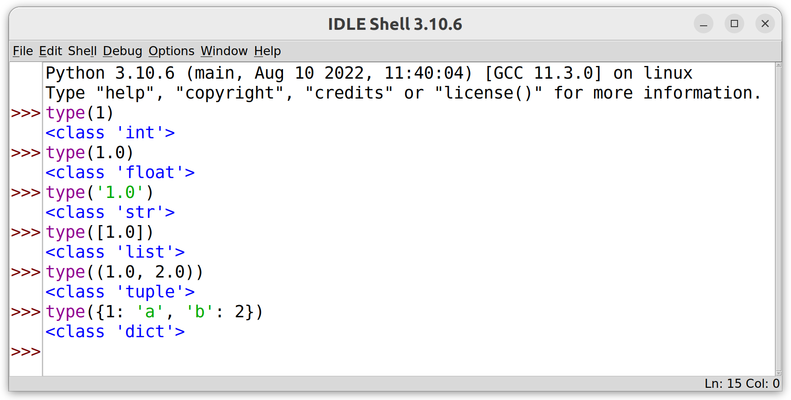
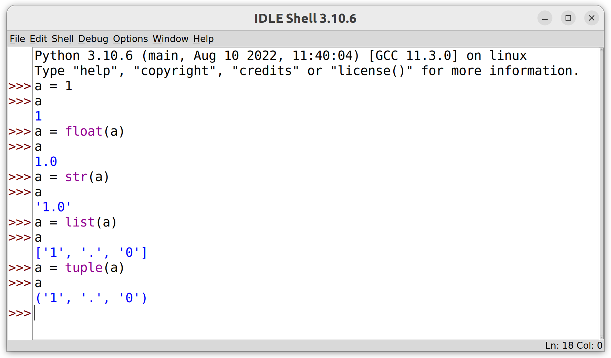
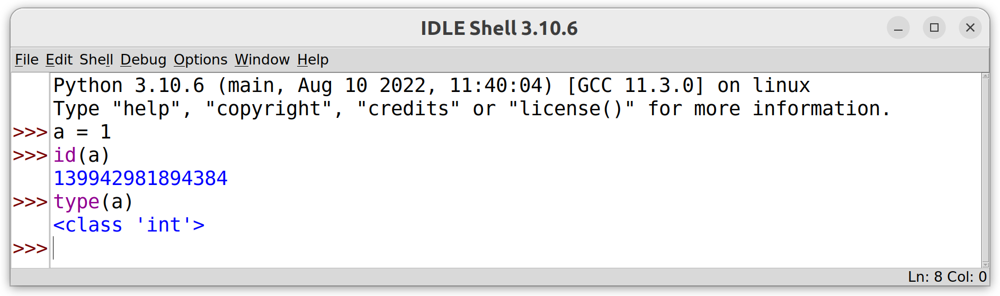
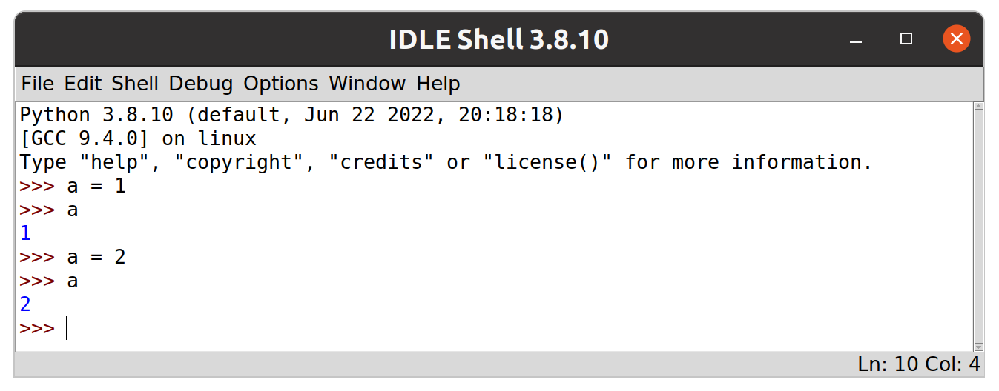
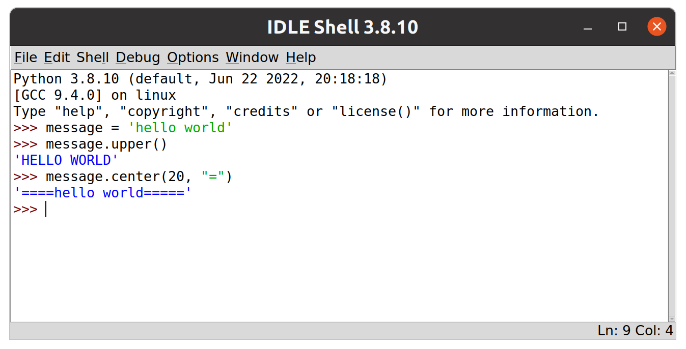
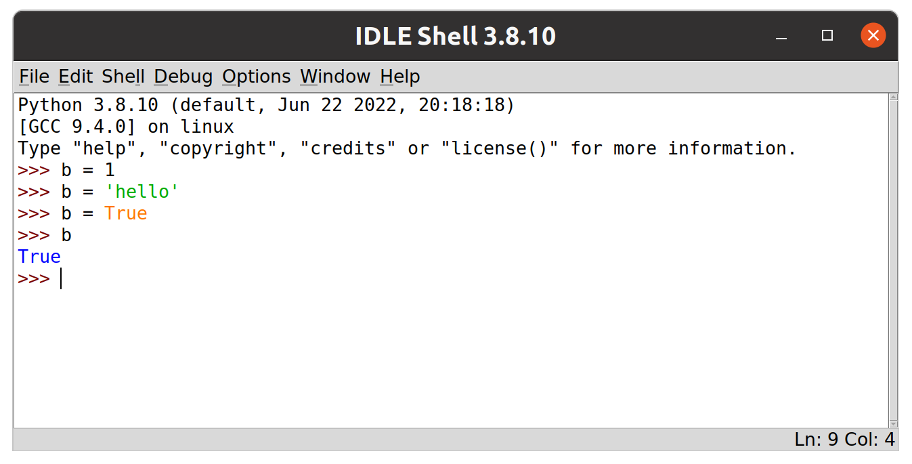

# GAMR1520: Markup languages and scripting

## Compound data types and looping

In the last set of exercises we introduced some basic python syntax and data types.
We also introduced compound statements using the conditional `if` as an example.

In this set of exercises, we will introduce *compound data types* such as the `tuple`, `list`, `dictionary` and `set` and explore what they can do.
We will also expand our exploration of compound statements by looking at `while` and `for` loops.

# Table of contents

<div class="toc"></div>

- [Sequences](#sequences)
    - [Slicing](#slicing)
    - [Sequences have length](#sequences-have-length)
    - [Tuples](#tuples)
    - [Other sequence operations](#other-sequence-operations)
- [Iterables and looping](#iterables-and-looping)
    - [The while loop](#the-while-loop)
    - [The for loop](#the-for-loop)
- [Everything is an object](#everything-is-an-object)
    - [What is an object?](#whats-an-object)
    - [Reassignment](#reassignment)
    - [Mutability](#mutabilityimmutability)
    - [Lists](#lists)

# Sequences

In Python, a `sequence` is any object that contains items in a particular order.
Sequences have a length and provide access to contained items using integer indices.

As we have already seen, a string literal in python is a sequence of characters in quotes.
We can create a string with a literal, or with the `input()` function.

```python
msg1 = 'hello world'
msg2 = input('type in a string: ')
```

Other common sequences include `tuples` and `lists`.
These are more general purpose data types.
Both `tuples` and `lists` represent a sequence of values.
The main difference is that `lists` are *mutable*, whereas `tuples` are not.
There are also more exotic sequences such as `range` which can be used to generate sequences of numbers in a memory-efficient manner.

The following section applies to all sequences.
To begin, we will consider sequence operations on the more familiar `string` type.
We will use `'hello'`.

```python
message = 'hello'
```

Start a new script file and add the above line.
You can obviously choose any string you like.
If you do use a different string then you can expect different results.

## Sequences have length

We can use the built-in `len()` function to find the length of any sequence.
If we pass a string into the `len()` function we get an integer back.

```python
len(message)    # 5
```

> An integer is not a sequence.
> So this will raise a `TypeError`.
>
>```python
>len(5)         # TypeError!
>```
>
> Actually, objects don't need to be sequences to work with the `len()` function.
> They only need to implement a `__len__` method which `len()` tries to call.
> All sequences support this.
> The `TypeError` occurs when no such method exists.

## Slicing

If we want to access items from a sequence, we can do it by specifying the position of the items we want.
This is known as *slicing*.

Each item (character) has a position in the sequence (the string) known as the `index`.
The `index` is an integer, beginning with `0` as the first item (character).
In the above string, the character at position zero is `'h'`.

Slicing syntax uses square brackets to indicate which character (or sequence of characters) we want to reference by index.
This simple example gets the first character of a string.

```python
message[0]  # 'h'
```

>Or try this:
>```python
>name = input('Enter your name: ')
>print(f'Hello {name}, your name begins with "{name[0]}".')
>```

### Multiple characters

For multiple characters, we can specify the start and end indices, separated by a colon.

```python
message[1:4] # 'ell'
```

The end index specifies the first character to exclude from the result.
So the return value of the above expression is a new string composed of the characters from indices 1, 2 and 3 but not position 4.

>People sometimes use the **i** and **e** in the word sl**i**c**e** to remember that the starting index is *inclusive* and the ending index is *exclusive*.
>You may or may not find this a useful way to remember the slicing behaviour.

We can also count from the end of the string using negative numbers.
Confusingly, the last character is indicated by an index of -1, the second last is -2 etc.

```python
message[-1] # 'o'
```

The above code returns the last character, an `'o'`.

We can, of course, use both positive and negative indices together.

```python
message[1:-2] # 'el'
```
The above code starts at the second character (index 1) and ends before the second character from the end (index -2).

Leaving an index blank whilst using a colon implies starting from the beginning or running to the end.

```python
message[:3]  # 'hel'
message[-3:] # 'llo'
```

Leaving both indices blank gives a copy of the original string.

```python
message[:]  # 'hello'
```

### Specifying a step

Slicing can also include a second colon and a final integer value to indicate the step.
So we can take a string and extract a new string which is composed of e.g. every second character starting at the 3rd character before the 17th character.

```python
message = 'happy birthday to you'
message[3:17:2] # 'p itdyt'
```

>This is all a little odd, and can be a major cause of confusion for some, but you get used to it very quickly with practice.

## Tuples

Tuples are sequences, just like strings.
However, they are much more flexible than strings because they can contain any values, not just characters.

We can define a tuple using square brackets surrounding items, separated by commas.

```python
numbers = (1, 2, 3, 4, 5, 6, 7, 8, 9, 10)
```

The tuple `numbers`, contains ten integers.
We can use indexing and slicing to access the individual elements, just like with strings.

```python
numbers[0]      # 1
numbers[3]      # 4
numbers[::3]    # (1, 4, 7, 10)
numbers[::2]    # (1, 3, 5, 7, 9)
numbers[1::2]   # (2, 4, 6, 8, 10)
```

Tuples can hold any type of data and can mix different types.
They are extremely efficient and effective ways of collecting related information together rather than having many named variables.

```python
item1 = ('first item', 1, 2.6, 33452, 'yellow')
item2 = ('second item', 4, 9.3, 1034, 'blue')
```

Note that tuple literals with a single element require a trailing comma within the brackets to clarify that the parentheses are indicating we want a tuple rather than simply parentheses.

```python
('hello')   # evaluates to just 'hello'
('hello',)  # evaluates to the tuple ('hello', )
```

## The *range* type 

Consider a tuple like this.

```python
numbers = (1, 2, 3, 4, 5, 6, 7, 8, 9, 10)
numbers[0]  # 1
numbers[9]  # 10
```

Now imagine if we wanted to extend this to 1,000,000 entries.
The act of creating the tuple will require all the values to be stored in memory.

The `range()` built-in allows us to create `range` objects which can achieve a very similar job with a fraction of the memory footprint.

```python
numbers = range(1, 1000001)
numbers[0]      # 1
numbers[999999] # 1000000
```

The above code creates a range object which is just what we needed.
It behaves exactly like the tuple we want, but it doesn't store the values in memory.
This is because it can calculate the value of any of its *virtual* items.

The `range()` function takes one, two or three arguments.
Similar to the *slicing* start, end and step values.
So we can also create ranges like this.

```python
fives = range(0, 101, 5)
len(fives)  # 21
fives[0]    # 0
fives[5]    # 25
fives[20]   # 100
```

Because sequences are zero-indexed, the last index is always one less than the length.

<blockquote class="challenge">
    <header>
        Slicing and ranges
    </header>
    <p>
        Write a programme that takes user input and outputs a requested times table.
    </p>
        <pre>>>> Enter a number [1 - 12]: 5
>>> (5, 10, 15, 20, 25, 30, 35, 40, 45, 50, 55, 60)</pre>
    <p>
        Can you use conditionals to restrict the programme to accept only integers between 1 and 12?
    </p>
    <p class="solution">
        Once you have attempted this, download the <a href="solutions/times_tables.py" download>solution</a> and compare.
        Can you improve the solution?
    </p>
</blockquote>

## Lists

Mos of the data types we have introduced so far (tuples, strings, booleans, integers and floats) are *immutable*, which means their values cannot be changed once created.
Immutability is an important concept and allows immutable types to be very simple and efficiently implemented.

We can see this demonstrated if we try to change a character within a string.

```python
message = 'hello'
message[1] = 'a'
```

The result is a `TypeError` saying that the `str` object does not support item assignment.

We get a similar result if we try to change an element of a tuple.

```python
data = ('hello', 'world')
data[1] = 'python'
```

The Python `list` is effectively a mutable version of the tuple data type.
There are three main built-in mutable data types in python, the `list`, `dict` and `set`.
Though they are deceptively simple, when used together, these simple types are powerful tools for creating flexible data structures within your programmes.

### Replacing elements

It's perfectly OK to replace an element in a python list.
We can do this by assigning to an element using the square bracket syntax we saw with slicing.

```python
my_list = ['apples', 'bananas']
my_list[1] = ['blueberries']
```

We can also replace multiple elements in a list using the familiar slicing syntax.

```python
my_list = list('hello')
my_list[2:4] = (1, 1)
```

> The above code first creates the list `['h', 'e', 'l', 'l', 'o'].
> It then replaces the specified slice (the ['l', 'l'] part) with a new sequence.

Any sequence can be used, and the length of the sequence doesn't have to be the same as the slice.

```python
my_list = list("abracadabra")
my_list[5:6] = range(3)
```

> Be careful because this will not produce the same result
> ```python
> my_list = list("abracadabra")
> my_list[5] = range(3)
> ```
> When assigning a sequence to an individual item, the sequence is inserted as a single item.
> To inject a sequence into another sequence requires the slicing notation which specified a sub-sequence to be replaced rather than a single item, even if the sub-sequence has a length of one.

If you want to, you can also use the slicing step notation to specify a distributed sequence.

```python
my_list = list("abracadabra")   # ['a', 'b', 'r', 'a', 'c', 'a', 'd', 'a', 'b', 'r', 'a']
my_list[::2] = range(6)         # [ 0,  'b',  1 , 'a',  2 , 'a',  3 , 'a',  4 , 'r',  5 ]
```

### Deleting elements

To remove an element from a mutable sequence, use the `del` keyword.

```python
my_list = list("abracadabra")   # ['a', 'b', 'r', 'a', 'c', 'a', 'd', 'a', 'b', 'r', 'a']
del my_list[::2]
my_list                         # ['b', 'a', 'a', 'a', 'r']
```

### Appending elements

We can also add items to a list using the `append()` method.
A *method* is a function that is defined within a class and so is associated with objects of that class.
This means methods can modify an object directly in potentially complex ways.

We call methods using dot notation like this:
```python
my_list = list('hello') # ['h', 'e', 'l', 'l', 'o']
my_list.append('hello') # ['h', 'e', 'l', 'l', 'o', 'hello']
```


## Other sequence operations

In addition to indexing and slicing, all sequences benefit from some very convenient operators such as `in`.

```python
'hello' in ('a', ('nested', 'tuple'), 'hello', [3, 2, 1])   # True
15 in range(0, 101, 5)                                      # True
'Q' in 'klnad87Qfadkna63kd'                                 # True
```

The `in` operator checks the sequence to see if the requested value appears as an item.
With strings, the `in` operator will also detect sub-strings.

```python
'or' in 'world'                                             # True
```

>The `in` operator works naturally with the `not` operator so a modified form is provided for readability and is preferred over the less clear alternative.
>```python
>not 0 in (1, 2, 3)  # <- don't use this
>0 not in (1, 2, 3)  # <- use this instead
>```

We can use the `+` operator to concatenate most sequence types together.

```python
'hello' + ' ' + 'world'   # 'hello world'
('one', 2) + ('three', 4.0)  # ('one', 2, 'three', 4.0)
```

> Mixing data types won't work usually.
> Also, range objects cannot be treated this way.

All sequences can be converted to tuples (or lists) easily.

```python
tuple('hello')          # ('h', 'e', 'l', 'l', 'o')
tuple(range(10, 21, 2)) # (10, 12, 14, 16, 18, 20)
list('hello')          # ['h', 'e', 'l', 'l', 'o']
list(range(10, 21, 2)) # [10, 12, 14, 16, 18, 20]
```

We can also use the `*` operator to repeat sequences multiple times.
In this case we need to 'multiply' by an integer.

```python
'hello ' * 3      # 'hello hello hello '
('hello', ) * 3   # ('hello', 'hello', 'hello')
```

>Notice the trailing comma for a 1-tuple literal.

> Again, range objects cannot be treated this way.
> But they can be converted to tuples or lists.

Combinations are possible.
The `*` operator takes precedence over the `+` operator.

Compare this: 

```python
message = 'hello ' * 3 + 'world'
```

with this:

```python
message = 'hello' + 3 * ' world'
```

> Try this with tuples or lists

Attempting to use the `*` operator with the wrong types will raise a `TypeError`, indicating that the type was wrong.
```python
'hello' * 'three'
'hello' * 3.2
```

# Iterables and looping

There are two main ways to loop in python.
We can either loop based on logic, using a `while` loop or we can loop over data, using a `for` loop.

## The `while` loop

A basic kind of loop is a `while` loop.
This acts as a kind of extended and continuous conditional.

The `while` clause is another compound statement and follows the same pattern as the `if` clause.
The header begins with the `while` keyword and a conditional test followed by a colon.

The indented code block following the header will be executed repeatedly as long as the conditional resolves to `True`.

> There is a real danger that a `while` loop can continue forever.
> If this happens, press `Ctrl + C` to exit the programme.

Here's a modified version of the conditional code that repeatedly transfers an amount from `balanceA` to `balanceB`.
It stops when `balanceA` is less than `amount`.

```python
balanceA = 95
balanceB = 0
amount = 10
print(f"balance A {balanceA}, balance B {balanceB}")
while balanceA >= amount:
    balanceA -= amount
    balanceB += amount
    print(f"balance A {balanceA}, balance B {balanceB}")
```

> `while` clauses can have `else` clauses added too which will execute once, when the conditional expression resolves to `False`.

One issue with the while loop is that the condition is always checked *before* the first execution of the code block.
Many languages include a `do...until` construct which allows code to be executed one *before* the conditional is tested.
Python has no such construct.

A common way to use a `while` loop in this way is to create an infinite loop (`while True`) and use the `break` keyword to exit the loop based on some condition.
This provides all the necessary flexibility.

```python
i = 0
while True:
    print(f"this is iteration {i}")
    if input("break loop? [y/n] ").lower().startswith('y'):
        break
    i += 1
```

> Notice the use of string methods `str.lower()`, `str.startswith()` and the use of `f-strings`.
> We will discuss these in the next section


The infinite loop keeps our code clean and avoids repetition.

## The `for` loop

In python, an `iterable` is any object that can release one item at a time.
Sequences are a special kind of *iterable* that yields its elements in order and supports integer indexing.

In practice, this means (amongst other things) that an *iterable* object (such as a sequence) can be looped over using a `for` loop, yielding each element in turn.

A `for` clause is similar to a `while` clause or an `if` clause.
However, in place of a conditional test, we name a variable and an iterable object.
The code block will repeat, setting the variable to each element in the iterable in turn and executing the code block.

```python
for i in (1, 2, 3):
    print(i)
```

In the above case, we declare a variable `i` within the header to receive each element of the iterable in turn.
the code block will be executed three times with the the variable `i` assigned to the values `1`, then `2` and then `3`.

This allows for fun with sequences.

```python
for ch in input("Enter your name: "):
    print(ch * 10 + "!")
```

The capabilities of `for` loops and `while` loops are subtly different.
Though in many cases they can be used interchangeably, there is often a natural fit to the problem at hand.

Consider how the following code uses looping to achieve a clear purpose.

```python
my_list = ()
while True:
    print('=' * 20)
    print('shopping list'.center(20))
    print('-' * 20)
    for item in my_list or ("EMPTY LIST".center(20),):
        print(item)
    print('=' * 20)
    keep_going = input("add an item to the list? [y/n]")
    if not keep_going.lower().startswith('y'):
        break
    my_list += (input("New item: "),)
```

The code above uses many of the techniques we have introduced to maintain a tuple containing strings representing items on a shopping list.
The programme starts by assigning an empty tuple to the `my_list` variable.
> This could easily be a `list`, but we chose a `tuple`.

The *infinite* `while` loop repeats the main code block until the `break` statement is reached when user decides to stop.

In each loop, the programme prints out the list with some formatting.
This takes most of the lines of code.
Once the list is printed, the programme then asks the user if they want to add an item to the list.

If their answer doesn't begin with a `'y'` then the programme breaks out of the loop and ends.
If they indicate that they want to continue, they are asked for a new item and whatever they enter is appended to the `my_list` tuple.

The programme can go on infinitely, but can easily be ended by the user.

> Were the user to add enough items to the list, the available memory would eventually run out.
However, it is likely that the user would run out of patience before this became a problem.

<blockquote class="challenge">
    <header>Write a thing</header>
    <p>
        OK, now you do a thing.
    </p>
    <p>
        Write a programme to ....
    </p>
</blockquote>


# Everything is an object

In python, pretty much everything is an object.
In this section, we will have a look at what that means in practice.

Firstly, objects always have a **type**.
We have seen that we can inspect the type of an object by using the `type` function.

<figure>
    
    <figcaption>Everything has a type</figcaption>
</figure>

We can also `cast` objects into different types using built-in functions such as `int`, `float`, `str`, `list`, `dict`, `tuple` (and more).
Essentially, every type has a built-in function which will attempt to convert data from one type into another.

<figure>
    
    <figcaption>Casting an integer into a float, string, list and tuple</figcaption>
</figure>

This process does not convert data in place, it creates a new object of the appropriate type.
In each case above, the original variable a still points to the original object.

>OK, we did this before, when we converted user input from a string to an float.

## What's an object?

We have seen that we can create variables by assigning values to them using the `=` operator.
We can do this with literal values or any valid python expression.

Let's return to a simple assignment operation.

```python
a = 1
```

What happens in the above example is not as simple as it looks.
Python does a lot of work behind the scenes to achieve this simple result.

First, an object is created in memory.
This object stores more than just the value (`1`).
It also stores data such as a unique identifier and the `type` (the fact we are dealing with an integer).

Importantly, it also stores a reference counter, which keeps track of how many references are pointing to the object in your programme.

<figure>
    <table>
        <tr>
            <th>PyObject</th>
            <th>#9801248</th>
        </tr>
        <tr>
            <td>id</td>
            <td>9801248</td>
        </tr>
        <tr>
            <td>type</td>
            <td>&lt;int&gt;</td>
        </tr>
        <tr>
            <td>value</td>
            <td>1</td>
        </tr>
        <tr>
            <td>ref count</td>
            <td>1</td>
        </tr>
    </table>
    <figcaption>Integer object</figcaption>
</figure>

Our variable `a` is a pointer to this object.
It's value is set to the location in memory where this object can be found.
This provides a way to access the object in our programme.

> Python has dynamically typed variables, the type is not associated with the variable, but with the data.

We can explore the object details by passing it into the built-in functions `id` (which gets the unique identifier of an object) and `type` (which gets the **type** of the object).
These built-in functions are called by passing our variable between parentheses.

<figure>
    
    <figcaption>Inspecting an integer object</figcaption>
</figure>

As we can see, our variable `a` is identified by the unique identifier `9801248`.
This identifier may be different in your case but it will *never* change within a programme.
We can also see that `a` is currently pointing to an integer.

## Reassignment

Assignment can also be used to modify the value of a variable.

Following from the above example.
We already have the value `1` stored in `a`.
Let's assign a new value to `a`.

<figure>
    
    <figcaption>Updating data in memory with reassignment</figcaption>
</figure>

It's important to understand that the original value `1` is not replaced in memory by the value `2`.
In fact, a new object has been created in memory with the value `2`.

<figure>
    <table>
        <tr>
            <th>PyObject</th>
            <th>#9801280</th>
        </tr>
        <tr>
            <td>id</td>
            <td>9801280</td>
        </tr>
        <tr>
            <td>type</td>
            <td>&lt;int&gt;</td>
        </tr>
        <tr>
            <td>value</td>
            <td>2</td>
        </tr>
        <tr>
            <td>ref count</td>
            <td>1</td>
        </tr>
    </table>
    <figcaption>New integer object with value 2</figcaption>
</figure>

The name `a` has simply been changed to point to the new object in memory.
This process decrements the reference count of the original object.

<figure>
    <table>
        <tr>
            <th>PyObject</th>
            <th>#9801248</th>
        </tr>
        <tr>
            <td>id</td>
            <td>9801248</td>
        </tr>
        <tr>
            <td>type</td>
            <td>&lt;int&gt;</td>
        </tr>
        <tr>
            <td>value</td>
            <td>1</td>
        </tr>
        <tr>
            <td>ref count</td>
            <td>0</td>
        </tr>
    </table>
    <figcaption>Original integer object now has ref count of 0</figcaption>
</figure>

When nothing references an object, it's memory will be automatically freed up for reuse.
The python **garbage collector** will clean up any objects with reference count of zero.


## Objects have special capabilities

Some objects have methods which can be used to manipulate or transform data.
A good example of this is any object of the `string` type.

>Note that strings are immutable, meaning that we cannot modify strings, we can only create new strings.


## String methods

There are also a number of convenient `methods` which allow us to generate new, modified versions of strings.
These methods are built into the string object itself.

We can generate an uppercase version of the string using the `upper` method.

```python
'hello world'.upper()
```
>the `lower`, `title`, and `capitalize` methods do similar things.

The `center` method generates a new string with a given length.
The new string contains the original string, centered and padded by the specified character.


```python
'hello world'.center(20, "=")
```

In this case, we need to specify arguments.
The first argument is how long the string should be (in characters).
The second argument is the character to use for padding.
This is an optional argument, the default value used if no argument is provided is a space.

>This may not seem very useful when we are working with literals.
>The value is more apparent when we are working with variables in memory.

<figure>
    
    <figcaption>strings are objects</figcaption>
</figure>

>In the figure we can see that these methods can be applied to convert unknown strings into the format we may need to e.g. report back to the user or conduct comparisons.

## f-strings

Consider this simple programme.

```python
name = input('Enter your name: ')
print(name + ' has ' + str(len(name)) + ' letters.')
```

This is a bit complicated.
Concatenating strings like this is not good practice.
For efficiency and clarity.
We can improve it by using the so-called f-string formatting system.

F-strings allow python expressions to be embedded within strings.
We create them by adding an `f` character *before* the first quotation mark and placing python expressions inside the string within curly braces.

```python
name = input('Enter your name: ')
greeting = f'Hello {name}'
print(greeting)
```

A more complicated example.

```python
name = input('Enter your name: ')
print(f'Hello {name}, your name has {len(name)} letters.')
```

This is much more intuitive to read than the concatenated example above.

> Interpolated expressions in f-strings are automatically converted to strings.


Looking a bit more deeply, we can use the built-in `id` function to find the unique identifier which is given to each object.

```python
id('hello')
```

Rather than creating another copy of the string, this code returns the exact same object.

```python
id('hel' + 'lo')
```

This is a property of immutable objects such as strings, booleans, integers, floats and tuples.

A tuple is an immutable sequence of objects.
```python
a = (1, 2, 'hello', False)
``` 

With mutable data such as lists, the results are very different.


# Mutability/Immutability


## Mutable types

In programming in general, its often very useful to be able to change a complex object rather than to create a new, transformed version of the object in memory.

Recall, for example, our simple shopping list programme.
Imagine we grew a tuple with 1,000 elements.
Adding the 1001st element requires a new object to be created, leading to a doubling of the memory footprint.
If the tuple included 1,000,000 elements, then the problem is multiplied.
Not only this, consider the amount of memory read/write operations required to build a 1,000,000-element tuple, one item at a time, from scratch.
Each additional item added to the list requires a larger and larger amount of work.

Perhaps at small sizes it will not really matter, but
clearly, an immutable tuple is not an efficient choice for this kind of programme.


### Dynamically typed variables

In many languages variable declarations also need to specify the `type` of the variable and the type of a variable cannot be changed.

Not so in python.
In python, variables are dynamically typed.
We can change the type of a variable by simply assigning to a value with a different type.

```python
b = 1
b = 'hello'
b = True
```

<figure>
    
    <figcaption>Updating the type of a variable in memory with reassignment</figcaption>
</figure>

This provides great power.

>With great power comes great responsibility.


>Once you feel confident, move on to the next sections and write a simple script.


# Challenges

Write a programme