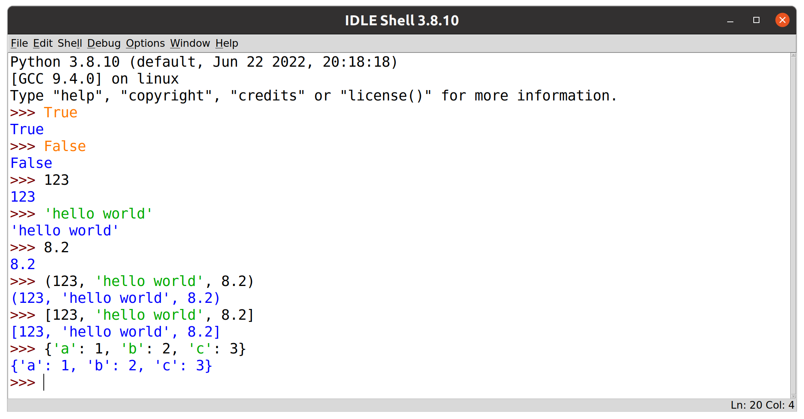

# GAMR1520: Markup languages and scripting

## Python literals

*Literals* are constant values of built-in types.
This may sound complicated, but they are just values, expressed directly in code.
For example, an integer value included directly in your code is known as an *integer literal*.

Type a number into IDLE.

```python
123
```

Unsurprisingly, when entered into IDLE, the expression evaluates to the value `123`.
This is what literals do.

Here are some more examples of literal values of different data types.

> Using a hash (`#`) at the beginning of a line creates a comment.
Comments are ignored by the interpreter.

```python
# Boolean literals
True
False

# A string literal.
'hello world'

# A float literal.
8.2

# A tuple literal with three values.
(123, 'hello world', 8.2)

# A list literal with three values.
[123, 'hello world', 8.2]

# A dictionary literal with three key-value pairs.
{'a': 1, 'b': 2, 'c': 3}
```

When interpreting these simple expressions, python is doing a surprising amount for you under the hood.
The interpreter evaluates the literal values into complex objects in memory and outputs a representation of the python objects they generate.

<figure>
    
    <figcaption>Literal values evaluate to themselves</figcaption>
</figure>

We will introduce the different data types later.
For now, the important thing to note is that we can express values directly in python code in this way.
As expected, they all evaluate to themselves.

>Notice that when literal values are evaluated they are presented back to us in a similar format to the literal syntax.

>Though single quotes are the default, we can use single or double quotes to specify string literals. 
>This allows us to include the `'` and `"` characters within strings.
>```python
>"A string containing 'single quotes'"
>'A string containing "double quotes"'
>```